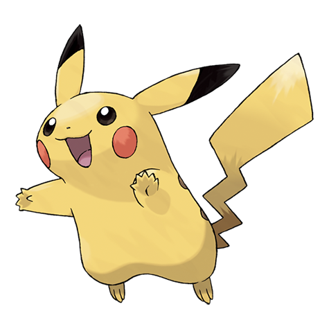

# GGPLOT2 Workshop
Repo to accompany the R ggplot2 workshop from Jasper Ridge data management &amp; publishing series, organized by Dr. Bryan Juarez. This module is led by (future Dr.) Kirsten Verster.

The workshop assumes _some_ knowledge of R (e.g. setting working directories, loading libraries, etc;), but we can work on it together if not! 

Please see the accompanying powerpoint for more details!

---

We will be walking through the R code here!

```
#Set the working directory to wherever your file is located, 
and load in the following packages (which should already be pre-installed):

setwd(C:/Path/to/file)
library("tidyverse")
library("ggplot2")
library("gridExtra")
```

Now, we will load in the Pokemon dataset. This dataset was taken from [The Complete Pokemon Dataset](https://www.kaggle.com/datasets/rounakbanik/pokemon), which contains information on all 802 Pokemon from 7 Generations. _Neeeeerddd._ The datset is titled **Pokemon.csv** and can also be downloaded from the GitHub. 

For those who are young and/or had friends growing up, Pokemon is a Japanese media franchise based on "pocket monsters" that you can train, befriend, coexist with. There are a lot of them, and there is a *passionate* culture centered around them. 



```
p <- read.csv("pokemon.csv")
#This puts the .csv into a list titled 'p'
```

To make the dataset more manageable, we will use the ```subset()``` function to only extract one generation (the first one, which is the best, obviously!). The syntax is ```subset(list, Column == "Desired_String")```.

```p<-subset(p, Generation =="1")```

Note: let's say you wanted to use all generations _except_ generation 5. Then, what you would use instead would be ```subset(p, Generation != "5")```. 


ggplot2 was made following the Grammar of Graphics, a textbook by Leland Wilkinson. A grammar of graphics is a framework which follows a layered approach to describe & construct visualizations or graphics in a structured manner. Hadley Wickham et al wrote [a book](https://ggplot2-book.org/) describing their incorporation of the Grammar of Graphics into the ggplot2 package. 


Take a look at the `p` dataset by Ctrl+Enter on the given line. You should see columns such as **Name, Type.1, Total, HP, Attack**, etc;. Each row corresponds to a given Pokemon 'species'. 
